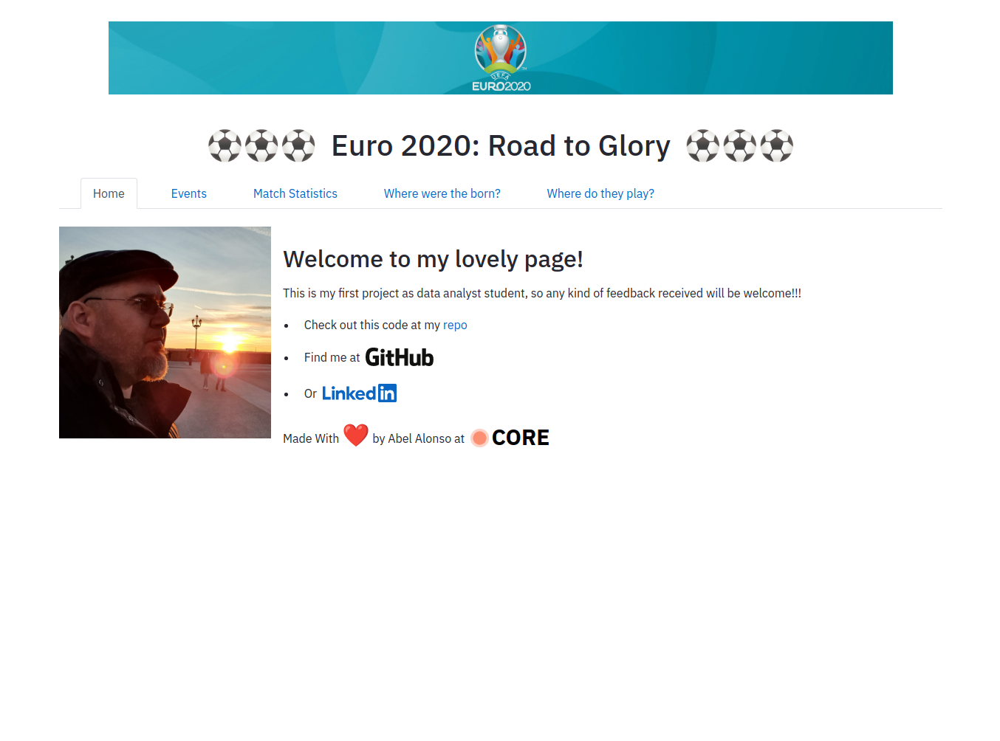
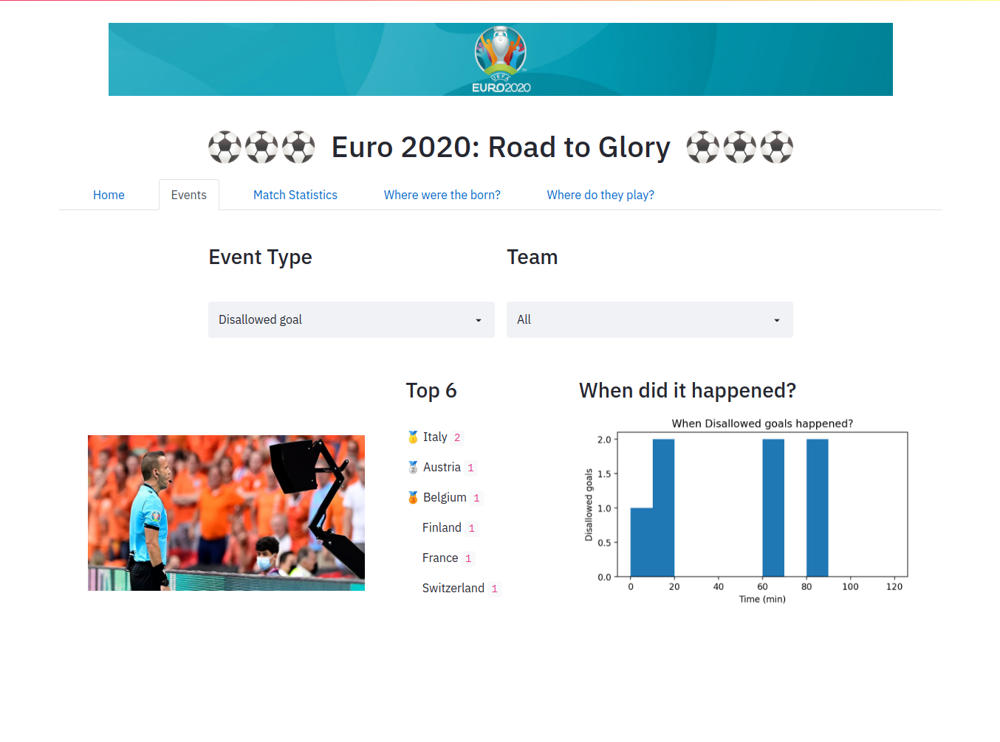
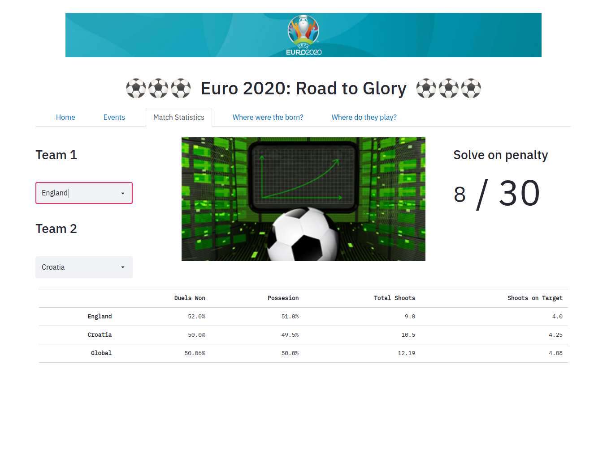
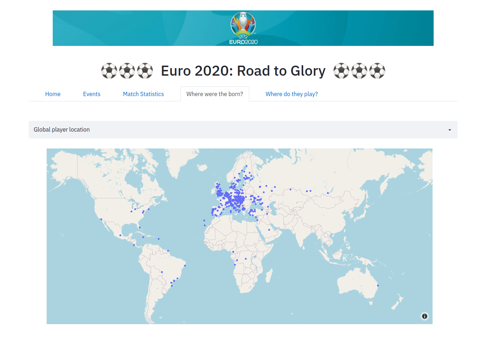
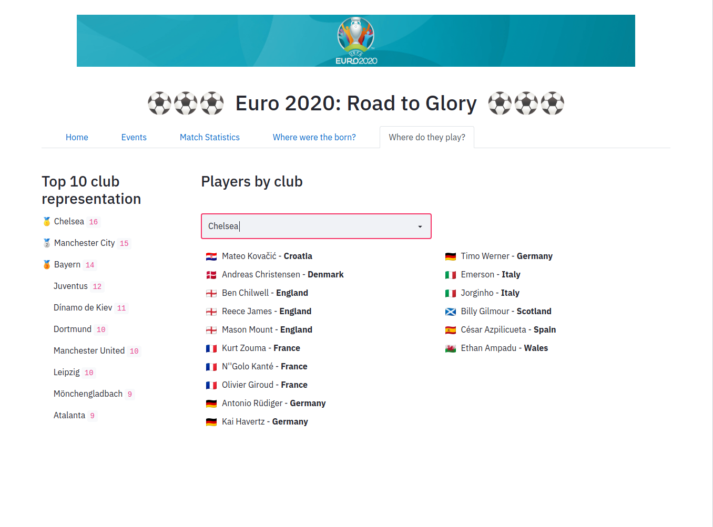
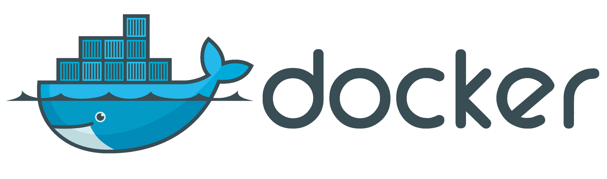
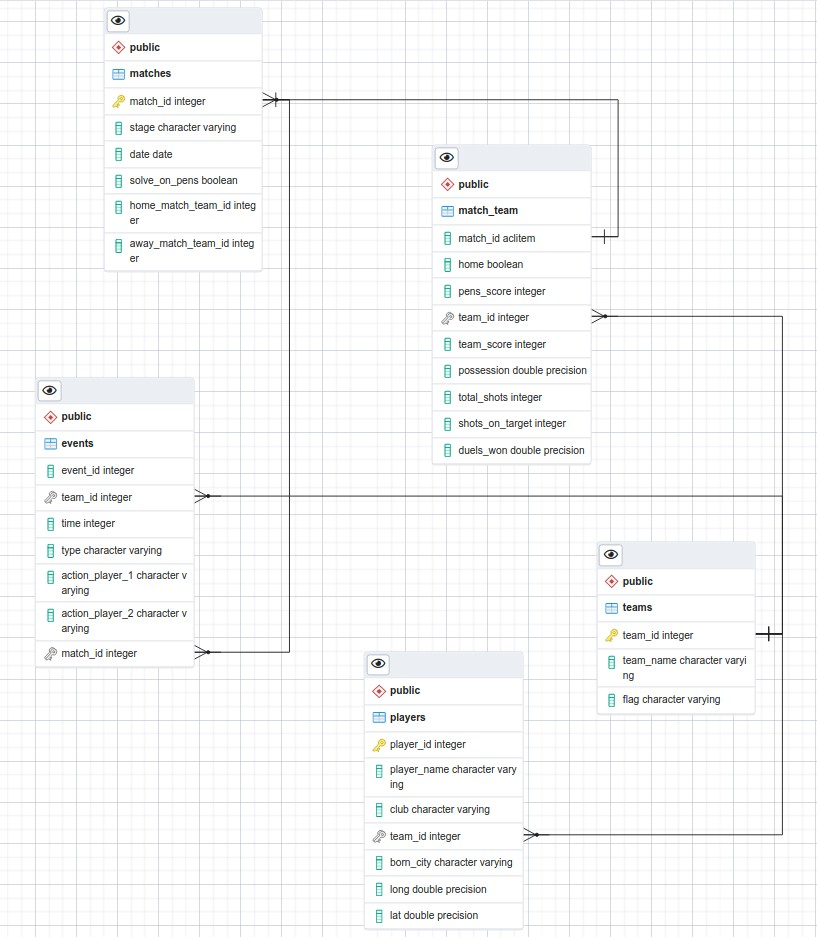

# Euro 2020

## If you keep on reading...

You will discover the steps I followed to reach that...
 
 

 

 

## Purpose of this project

This project was made to experiment and have fun with some data cleaning, analysis and visualization tools. I've been using this technologies on the project, you can click to know more about them...

 

### **Data cleaning**

 

 

### **API**

 

 

### **Front**

 

 

### **Deploy**

 

 

 

## Data cleaning

### Teams dataset
  - Stage: First stage matches grouped on the same category.
  - Dates: Changed format to [ISO 8601](https://es.wikipedia.org/wiki/ISO_8601).
  - Possession and won duels: Setted percentage string to a value between 0 and 1.
  - Pens_score: Setted to NULL false string when match is not solved by pens.
  - Spaces on strings: Start and end spaces removes from every categorical column.
  
### Generated dataset with events

  - We notice that there are data on event_result and event_player on PK events.
  - On type column, we set value to PK-Goal and PK-Missed in this cases
  - In this cases, event_player info will be setted on action_player_1
  - Dropped event_result, event_player columns
  - Event_time on type=PK setted to 120 (end time of extra time)
  - Event_team will store team_id instead home/away. This vale comes from the table created on 01_matches.ipynb
  - We notice incoherent data on action_player_2 (Own goal, Penalty) the same than in action_player_1

 

 

## Database Tables

 

 

 

## API endpoints

### /
  - Just to check connection.

### /events?type=aaa
  - Match events grouped by team from matches.
  - Returns type events summatory.

### /events-player?type=aaa&player=2
  - Match events grouped by player from matches.
  - Returns type events summatory. Query param player 2 defines assistant on a goal or outcome player in a substitution.
  
### /events-team/team?type=aaa&player=2
  - Match events grouped by players from a team.
  - Returns type events summatory. Query param player 2 defines assistant on a goal or outcome player in a substitution.

### /masters/<table>/<column>
  - Returns unique values form a column in a tabel

### /matches/<team>?team=aaa
  - Returns team events from a match.
  - If team=all return all events

### /penalty?type=[all, winner, looser]
  - If type=all returns all matches solved by pens.
  - Otherwise return teams winners/loosers by pens.

### /players-location
  - Returns players born city longitude and latitude.

### /players-location/<country>
  - Returns players born city longitude and latitude from a team.

### /players-club
  - Returns players summatory grouped by club.
### /players-club/<club>
  - Returns players from the same club.

 

 

## API structure

    |
    |__ \
        |----server.py         -> entry point
        |----app.py            -> app instance creation
        |----config.py         -> app config file
        |----Dockerfile        -> docker container structure
        |----requeriments.txt  -> app dependencies
        |
        |____\controllers
        |     |----events_controller.py     -> events-endpoint
        |     |----masters_controller.py    -> masters-endpoint
        |     |----matches_controller.py    -> matches-endpoint
        |     |----penalty_controller.py    -> penalty-endpoint
        |     |----players_controller.py    -> players-endpoint
        |     |____root_controller.py       -> root-endpoint
        |
        |____\utils
              |----db_connetion.py          -> execute query function
              |----handle_error.py          -> error handler decorator
              |----json_response.py         -> return json from query function
              |----sql_queries.py           -> sql queries
              |____sql_utils.py             -> functions to configure queries

 

 

## Frontend structure

    |
    |__ \
        |----main.py           -> entry point
        |----styles.css        -> css styles to change app look&feel
        |----Dockerfile        -> docker container structure
        |----requeriments.txt  -> app dependencies
        |
        |____\controllers
        |     |----config.py             -> app config file
        |     |----utils                 -> common functions and const
        |     |----_404_.py              -> error page
        |     |----tabs.py               -> parent component with tabs structure
        |     |----tab_home              -> home page
        |     |----tab_events            -> events page
        |     |----tab_statistics        -> statistics page
        |     |----tab_location          -> locations page
        |     |____tab_club              -> club page
        |
        |____\images                     -> Different images used in the frontend app
              